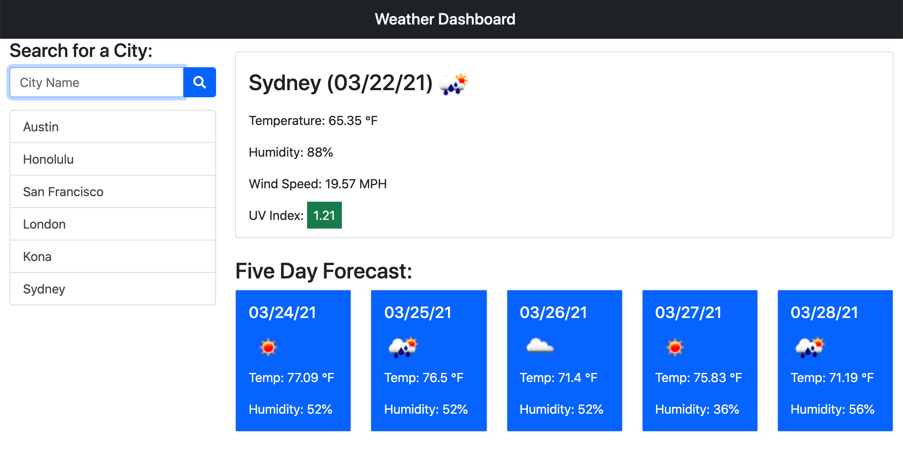
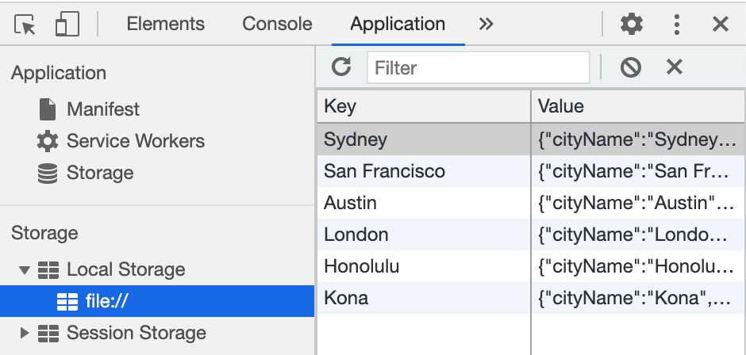
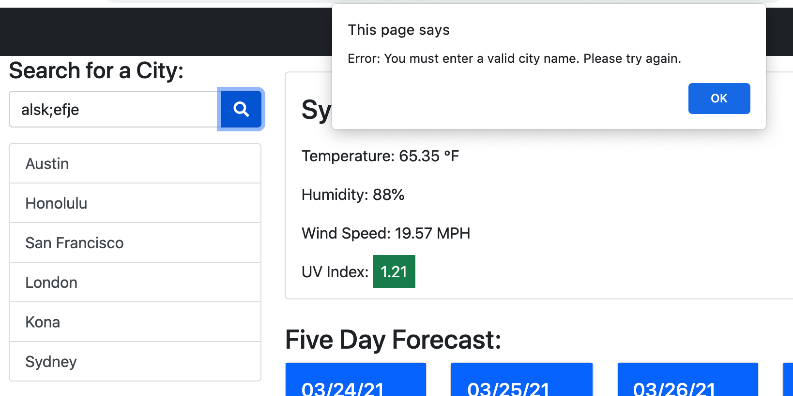

# Susan Fujii's Weather Dashboard

## Table of Contents

- [Description](#Description)
- [Motivation](#Motivation)
- [Why I Built This](#Why-I-Built-This)
- [What I Learned](#What-I-Learned)
- [Installation](#Installation)
- [Usage](#Usage)
- [Screenshots](#Screenshots)
- [Credits](#Credits)
- [License](#License)
- [Features](#Features)
- [Contribute](#How-to-Contribute)

## Description

This weather dashboard allows a user to enter in any city around the world and see both current weather data for that city (city name, date, temperature, humidity, wind speed, and UVI) and the upcoming five-day forecast information. The app also stores recent city lookups to local storage, allowing the user to quickly click on recent cities in the list below the search box and retrieve the corresponding weather data from storage instead of having to wait for a longer "fetch" query from Open Weather. This app sanitizes user input, converting all strings to "Title Case" (e.g. "San Francsico" not san francisco or sAN fRAnciscO) so that cities are not inadvertently saved multiple times in different cases. This app also checks to see whether a user has entered in an impossible city name (e.g. "z;eiofaoifhjzdkncm") and alerts them that they need to enter in a valid city.

This app uses a third-party API [OpenWeather API](https://openweathermap.org/api) to retrieve weather data for cities.

### Motivation

Travelers and vacation planners often want to see the weather outlook for multiple cities they are considering so they can plan their trip(s) accordingly. They especially appreciate color-coded information and icon images showing them "at-a-glance" what the weather is like that particular day.

### Why I Built This

My family is actually very excited to use this app! We love to travel and have many friends from around the world and love to see what the weather is like there. This is a great and light app (no ads, no overhead, no drama....just weather when you need it) and I forsee us using this often. 

### What I Learned

This was a fun project! First I had to research the various Open Weather API's available (there are several free ones.) I decided to use the One Call API because it had everything I needed in one call, although I also first used their Geocoding API to reverse geocode the latitude and longitude from the city name. Then I used Bootstrap to design the UI, vanilla JavaScript to dynamically build the HTML elements to display the current weather and five-day forecast results, and a bit of logic to check whether the city weather was already stored locally in local storage or whether I needed to go retrieve it. More practice with event listeners, looping, and if/else conditional logic, and of course local storage. It was also fun to display the weather icons-- I dynamically built an image source string using the weather icon id from Open Weather. Very cool (the icons, not me.) :-)

## Installation
To view this project, simply visit (https://srfujii.github.io/Weather_Dashboard/index.html)
 
To install this project on your local machine, simply visit this repo at (https://github.com/srfujii/Weather_Dashboard) and use git to clone it to your local environment.

## Usage
This app is self-explanatory-- users can enter in a city of their choosing and click the "search" button to display that city's current weather and upcoming five-day forecast. Recently searched cities are saved to local storage and displayed below the search box for ease of access. 

## Screenshots
Here are some screenshots for you to preview how the Weather Dashboard looks and feels:

### Weather Dashboard UI:

## Credits

1. [Rice Technology Bootcamp](https://techbootcamps.rice.edu/)

### Resources:

1. [Open Weather One Call API](https://openweathermap.org/api/one-call-api)
2. [Geocoding API](https://openweathermap.org/api/geocoding-api#reverse)
3. [Moment.js UNIX Timestamp](https://momentjs.com/docs/#/parsing/unix-timestamp/)
4. [Moment.js Date Formatting](https://momentjs.com/docs/#/displaying/)
5. [EPA UV Index Scale Colorization](https://19january2017snapshot.epa.gov/sunsafety/uv-index-scale-1_.html#:~:text=A%20UV%20Index%20reading%20of%203%20to%205%20means%20moderate,when%20the%20sun%20is%20strongest.&text=swimming%20or%20sweating.-,Watch%20out%20for%20bright%20surfaces%2C%20like%20sand%2C%20water%20and%20snow,reflect%20UV%20and%20increase%20exposure.)
6. [BootStrap Colors & Styling](https://getbootstrap.com/docs/4.0/utilities/colors/)
7. [BootStrap List Group](https://getbootstrap.com/docs/4.4/components/list-group/)

## License
[MIT License](./license.txt)

## Features

<ol>
    <li>User input box to input desired city name</li>
    <li>Search button allows user to search for desired city data</li>
    <li>City name "sanitized" and stored in Title Case in local storage</li>
    <li>Alert presented to user if he/she types in gibberish or no city name</li>
    <li>City names and city weather objects stored in local storage for fast repeat searches</li>
    <li>Recently viewed city names appear as clickable buttons under search input box</li>
    <li>Current weather displayed for city (Name, date, temperature, humidity, wind speed, UVI, Icon)</li>
    <li>Five-Day forecast information displayed below current weather info (date, temperature, icon, humidity)</li>
    <li>Current UVI is colorized based on EPA color index</li>
    <li>Weather icons displayed for current and five-day forecasts</li>
    <li>Semantic HTML implemented in HTML and CSS</li>
    <li>ELements follow logical structure</li>
    <li>Appropriate comments and folder structure used</li>
    <li>All buttons and links work</li>
    <li>Title is concise and descriptive</li>
</ol>

## How to Contribute

